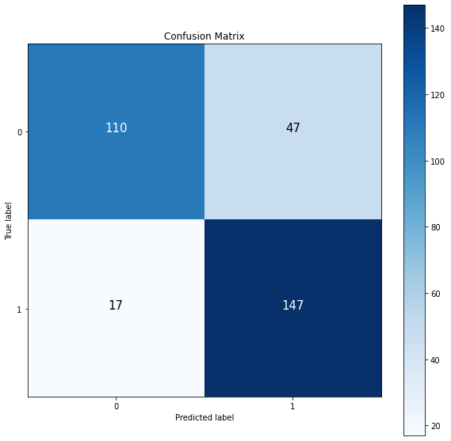
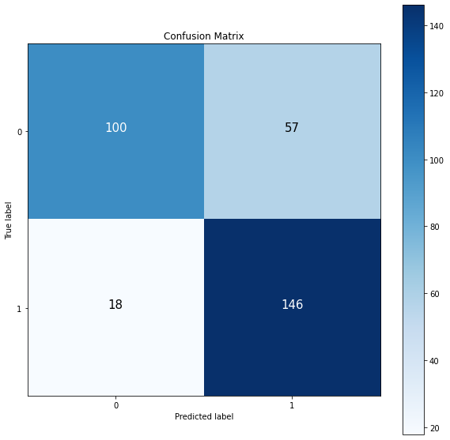
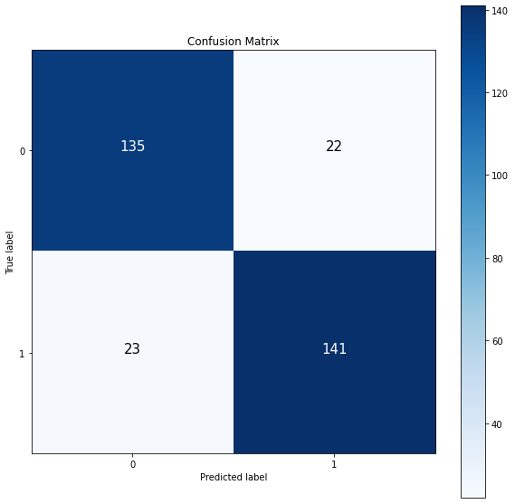
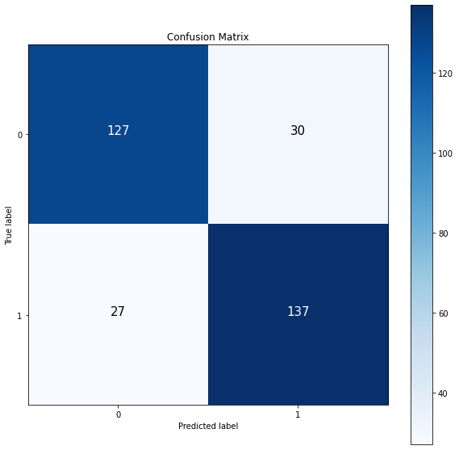

# Classification of Ship and IceBerg
### Introduction
The Statoil Iceberg Classifier Challenge is a dataset available on Kaggle that provides a unique opportunity to apply deep learning techniques to a real-world problem. The dataset includes images of ships and icebergs, taken from a satellite, and the goal is to classify these images as either a ship or an iceberg.

## Road Map
### Part 1: Band1 or Band2, scaled or orginal data
In part 1, we use DNN for Band1 and 2 on the scaled and original datasets to find which set of data works better.
-Implementing DNN for Band1 on the original dataset

-Implementing DNN for Band1 on the scaled dataset

-Implementing DNN for Band2 on the original dataset

-Implementing DNN for Band2 on the scaled dataset

### Part 2: Rotate the Images based on the inc_angle
In part 2, we rotate all images based on the inc_angle to remove the impact of the inc_angle.

Please note that there are 133 missing data for the inc_angle. We fill these values with the mean of the inc_angle.

### Part 3: Instead of filling the missing data, we drop them.

### Part 4: We apply data augmentation.

### Part 5: we combine band1 and band2 to generate new band which contains the information from both bands.

### Part 6: we compare the results

## Pat 1: 
Let's compare the results for band1 and 2 on the original and scaled dataset.

Band1 Original Dataset: 
Loss : 0.6           
Accuracy: 80%
Band2 Original Dataset: 
Loss : 0.5        
Accuracy: 77%
Band1 Scaled Dataset: 
Loss : 0.38         
Accuracy: 86%
Band2 Scaled Dataset: 
Loss : 0.39         
Accuracy: 82%

Let's visualize the results by the confuison matrix

Band1 Original Dataset: 

-------------------------------------------
Band2 Original Dataset: 

-------------------------------------------
Band1 Scaled Dataset: 

-------------------------------------------
Band2 Scaled Dataset: 

-------------------------------------------
# Part 1 Conclusion:
According to the results from part 1, Band1 with the scaled dataset has the best performance on the DNN model.

Confusion Matrix Analsys:

The DNN model correctly identified 141 out of 164 Icebergs and misclassified 23 as ships. It also accurately predicted 135 out of 157 ships, but wrongly identified 22 as Icebergs.

