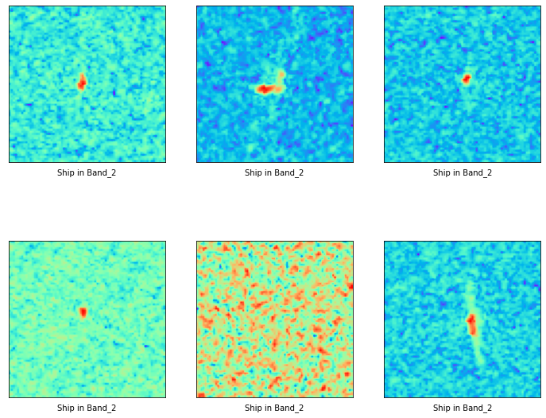
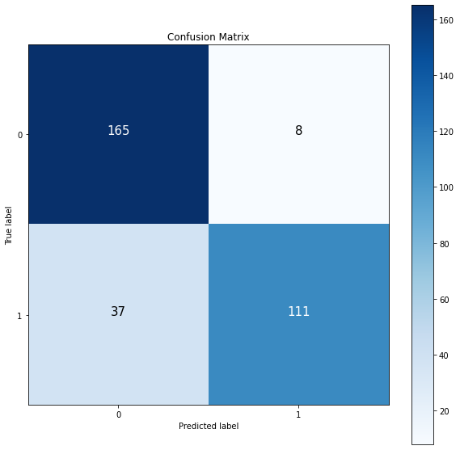
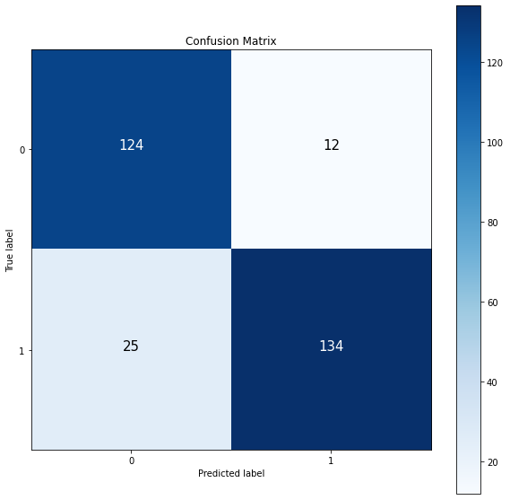
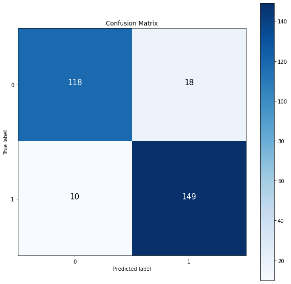

# Classification of Ship and IceBerg
### Introduction

The Statoil Iceberg Classifier Challenge is a dataset available on Kaggle that provides a unique opportunity to apply deep learning techniques to a real-world problem. The dataset includes images of ships and icebergs, taken from a satellite, and the goal is to classify these images as either a ship or an iceberg.

# Method:

To address this challenge, we followed a multi-step approach. In Part 1, we trained two different Deep Neural Network (DNN) models, one with the original dataset and another with the scaled dataset, to determine which dataset would result in the best performance.
In Parts 2 and 3, we rotated all the images based on the inc_angle to remove its impact on the model's performance. We filled in the missing values for inc_angle and then dropped them to observe the results.
In Part 4, we combined the information from Band1 and Band2 to create a new band, which contained information from both bands. 
In Part 5, we used machine learning algorithms for classification, to compare the deep learning and machine learning models.

## Road Map

### Part 1: Band1 or Band2, scaled or orginal data

In part 1, we use DNN for Band1 and 2 on the scaled and original datasets to find which set of data works better.

-Implementing DNN for Band1 on the original dataset

-Implementing DNN for Band1 on the scaled dataset

-Implementing DNN for Band2 on the original dataset

-Implementing DNN for Band2 on the scaled dataset

### Part 2: Rotate the Images based on the inc_angle

In part 2, we rotate all images based on the inc_angle to remove the impact of the inc_angle.

Please note that there are 133 missing data for the inc_angle. We fill these values with the mean of the inc_angle.

### Part 3: Rotate the Images based on the inc_angle

Instead of filling the missing data, we drop them.

### Part 4: Combine Band1 and Band2:

we combine band1 and band2 to generate new band which contains the information from both bands.

### Part 5: Machine Learning

### Part 6: Conclusion

### Data Visualization: 
Let's Visualize the data

## Part 1: 
Let's compare the results for band1 and 2 on the original and scaled dataset.

Band1 Original Dataset: 

Loss : 0.6           
Accuracy: 80%

Band2 Original Dataset: 

Loss : 0.5        
Accuracy: 77%

Band1 Scaled Dataset: 

Loss : 0.38         
Accuracy: 86%

Band2 Scaled Dataset: 

Loss : 0.39         
Accuracy: 82%

Let's visualize the results by the confusion matrix

Band1 Original Dataset: 

-------------------------------------------
Band2 Original Dataset: 

-------------------------------------------
Band1 Scaled Dataset: 

-------------------------------------------
Band2 Scaled Dataset: 

-------------------------------------------
## Part 1 Conclusion:
According to the results from part 1, Band1 with the scaled dataset has the best performance on the DNN model.

Confusion Matrix Analsys:

The DNN model correctly identified 141 out of 164 Icebergs and misclassified 23 as ships. It also accurately predicted 135 out of 157 ships, but wrongly identified 22 as Icebergs.

## Part 2: Rotation on the Filled dataset
As The Band1 and the scaled dataset had the highest accuracy, we use them to apply rotation. We fill the missing data on the inc_angle with mean of inc_angle.

Results: 

Loss : 0.43         
Accuracy: 86%

Confusion Matrix:

## Part 3 : Rotation on the dropped dataset.
Let's drop the missing values instead of filling them with mean, and after that apply the rotation.

Results

Loss : 0.31        
Accuracy: 87%

Confusion Matrix:

## Part 2 and 3 Conclusion:

In parts 3 and 4, it was observed that the accuracy of the model can be improved by rotating the images by the specific inc_angle for each image and removing the missing values and their corresponding images.

## Part 4: Combining Band1 and Band2

In this section, we merge two bands to create a new band that contains information from both bands.

Results
Loss : 0.28        
Accuracy: 91%

Confusion Matrix:

# Part 5 Machine Learning: 

Let's see the results for two machine learning classification models.

### Random Forest:

RFC accuracy without scaling 70.51%

RFC accuracy with scaling 69.83%

### Support Vector Machine: 

SVC accuracy without scaling 69.83%

SVC accuracy with scaling 53.90%

# Results:

The results of our experiments showed that the DNN model performed better with the scaled dataset of Band1 compared to the original dataset. Rotating the images by the specific inc_angle for each image and removing the missing values improved the accuracy of the model. Combining the information from both bands also resulted in an improved accuracy, with over 90% accuracy. However, the traditional machine learning algorithms did not perform as well as the deep learning algorithms.

| Model         | Data            | Loss     | Accuracy      |
| :------------ |:---------------:| -----:   | :------------ |
| DNN      | Band1 Original | 0.6    |           80%    |
| DNN      | Band1 Scaled        |   0.38    |      86%         | 
| DNN | Band2 Original        |    0.5    |          77%     |
| DNN | Band2 Scaled        |    0.39    |        82%       |
| DNN | Rotated and Filled        |    0.43    |      86%         |
| DNN | Rotated and Droped       |    0.31    |          87%     |
| RandomForest | Band1        |   ---    |         70.51 %      |
| SVM | Band1       |  ---      |        69.83%       |     
| DNN | Band1 + Band2       |    0.28   |        91%       |

# Part 6 Conclusion:

In conclusion, the first finding shows that Deep Learning models perform significantly better than Machine Learning models. Additionally, the combination of both bands resulted in a decrease in the loss function and an increase in accuracy, as reflected in the improved confusion matrix.
