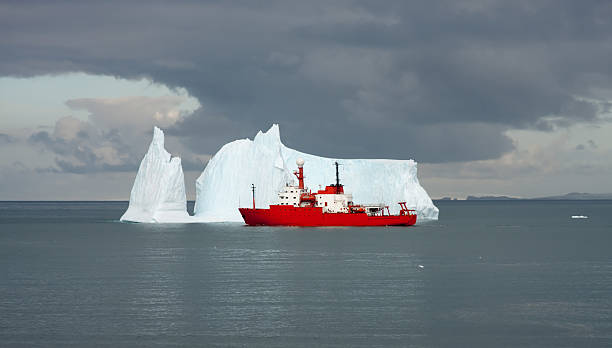
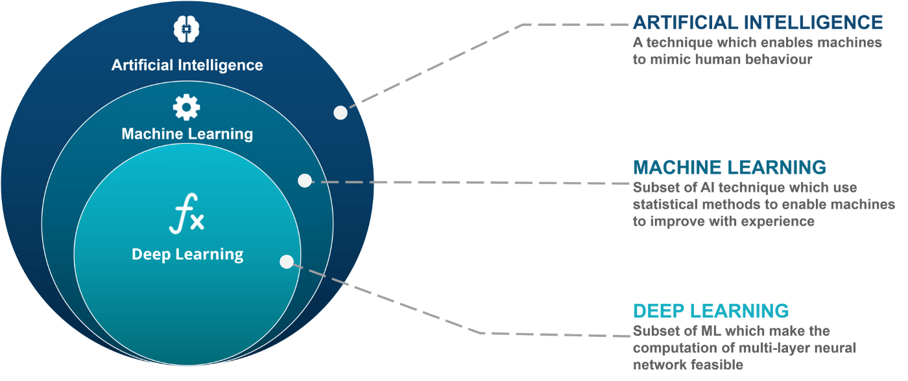
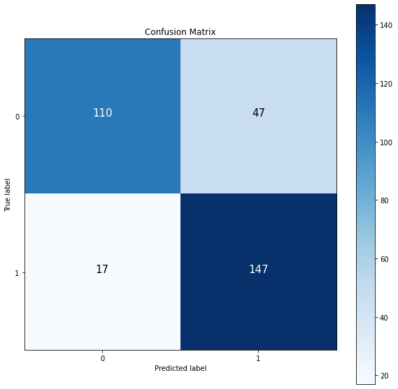
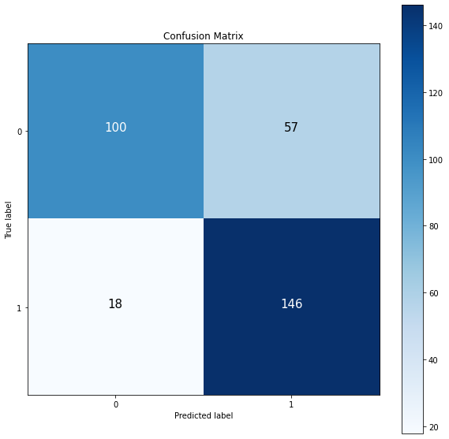
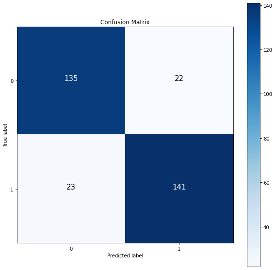
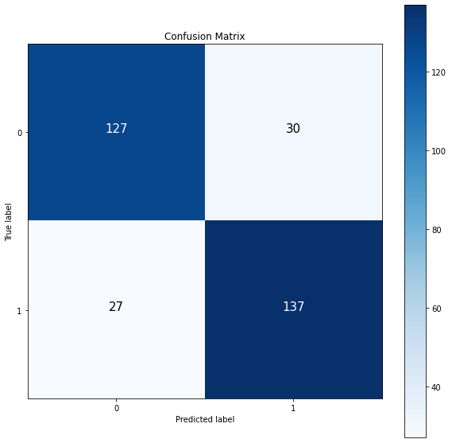
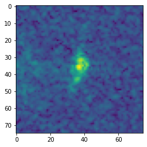
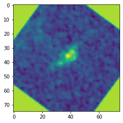
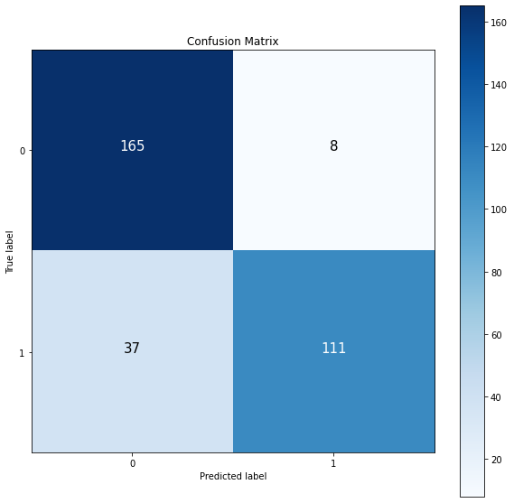
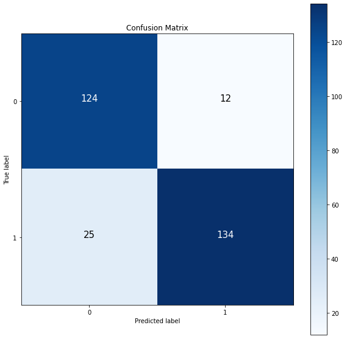

# **Ship-Iceberg Classification with Machine Learning and Deep Learning**

### Introduction

The Statoil Iceberg Classifier Challenge is a dataset available on Kaggle that provides a unique opportunity to apply deep learning techniques to a real-world problem. The dataset includes images of ships and icebergs, taken from a satellite, and the goal is to classify these images as either a ship or an iceberg.

# Method:

To address this challenge, we followed a multi-step approach. In Part 1, we trained two different Deep Neural Network (DNN) models, one with the original dataset and another with the scaled dataset, to determine which dataset would result in the best performance.
In Parts 2 and 3, we rotated all the images based on the inc_angle to remove its impact on the model's performance. We filled in the missing values for inc_angle and then dropped them to observe the results.
In Part 4, we combined the information from Band1 and Band2 to create a new band, which contained information from both bands. 
In Part 5, we used machine learning algorithms for classification, to compare the deep learning and machine learning models.

## Road Map

### Part 1: Band1 or Band2, scaled or orginal data

In part 1, we use DNN for Band1 and 2 on the scaled and original datasets to find which set of data works better.

-Implementing DNN for Band1 on the original dataset

-Implementing DNN for Band1 on the scaled dataset

-Implementing DNN for Band2 on the original dataset

-Implementing DNN for Band2 on the scaled dataset

### Part 2: Rotate the Images based on the inc_angle

In part 2, we rotate all images based on the inc_angle to remove the impact of the inc_angle.

Please note that there are 133 missing data for the inc_angle. We fill these values with the mean of the inc_angle.

### Part 3: Rotate the Images based on the inc_angle

Instead of filling the missing data, we drop them.

### Part 4: Combine Band1 and Band2:

we combine band1 and band2 to generate new band which contains the information from both bands.

### Part 5: Machine Learning

### Part 6: Conclusion

### Data Visualization: 
Let's Visualize the data

## Part 1: Convolutional Neural Network CNN, Conv2D for Band1 and Band2

### General Conv2D architecture

Let's compare the results for band1 and 2 on the original and scaled dataset.

| Model         | Data            | Loss     | Accuracy      |
| :------------ |:---------------:| -----:   | :------------ |
| DNN, CNN, Conv2D     | Band1 Original | 0.6    |           80%    |
| DNN, CNN, Conv2D      | Band1 Scaled        |   0.38    |      86%         | 
| DNN, CNN, Conv2D | Band2 Original        |    0.5    |          77%     |
| DNN, CNN, Conv2D | Band2 Scaled        |    0.39    |        82%       |

Let's visualize the results by the confusion matrix

| Band1 Original Dataset        | Band2 Original Dataset    |
| :------------ |:---------------:|
|       |  |

-------------------------------------------

| Band1 Scaled Dataset        | Band2 Scaled Dataset    |
| :------------ |:---------------:|
|     |  |

-------------------------------------------
## Part 1 Conclusion:

According to the results from part 1, Band1 with the scaled dataset has the best performance on the DNN, CNN Conv2D, model.

**Confusion Matrix Analsys for Scaled Band1**:

The DNN model correctly identified 141 out of 164 Icebergs and misclassified 23 as ships. It also accurately predicted 135 out of 157 ships, but wrongly identified 22 as Icebergs.

## Part 2 and 3: Apply Rotation on the filled and dropped inc_angle

### Data Visualization for the rotation around the inc_angle

| Before Rotation         | After Rotation    |
| :------------ |:---------------:|
|       |  |

**Method**

To apply rotation, the dataset that had the highest accuracy, which was The Band1 dataset and its scaled version, was selected. To make the data suitable for classification, missing values in the "inc_angle" column were filled in using the average value of "inc_angle". After classification was performed on this dataset, in the third part, the rows with missing values in the "inc_angle" column were removed from the dataset rather than being filled in with the average of "inc_angle".

**Results:**

| Filled with the mean        | Dropped inc_angle    |
| :------------ |:---------------:|
|      |  |

---------------------------------------------------------------------------------------------------

| Model         | Data            | Loss     | Accuracy      |
| :------------ |:---------------:| -----:   | :------------ |
| DNN | Rotated and Filled        |    0.43    |      86%         |
| DNN | Rotated and Droped       |    0.313    |          87.4%     |

## Part 2 and 3 Conclusion:

In parts 3 and 4, it was observed that the accuracy of the model can be improved by rotating the images by the specific inc_angle for each image and removing the missing values and their corresponding images.

## Part 4-1 and 4-2 : Combining Band1 and Band2

In this section, two bands were combined to create a new band that contains information from both bands. Initially, a Conv2D model was used to classify icebergs and ships without applying rotation. In the next step, in part 4-2, rotation was applied. For this part, the dataset with rows removed for missing values of "inc_angle" was used, as this dataset had the best performance.

**Results:**

| Band1 + Band2       | Band1 + Band2+ Rotation    |
| :------------ |:---------------:|
|     |  |

| Model         | Data            | Loss     | Accuracy      |
| :------------ |:---------------:| -----:   | :------------ |
| DNN | Band1 + Band2       |    0.309   |        87.8      |
| DNN | **Band1 + Band2+ Rotation**    |    **0.30**   |        **89.15%**       |

# Part 5 Machine Learning: 

Let's see the results for two machine learning classification models.

### Random Forest:

RFC accuracy without scaling 70.51%

RFC accuracy with scaling 69.83%

### Support Vector Machine: 

SVC accuracy without scaling 69.83%

SVC accuracy with scaling 53.90%

# Results:

The results of our experiments showed that the DNN model performed better with the scaled dataset of Band1 compared to the original dataset. Rotating the images by the specific inc_angle for each image and removing the missing values improved the accuracy of the model. Combining the information from both bands also resulted in an improved accuracy, with over 89% accuracy. However, the traditional machine learning algorithms did not perform as well as the deep learning algorithms.

| Model         | Data            | Loss     | Accuracy      |
| :------------ |:---------------:| -----:   | :------------ |
| DNN      | Band1 Original | 0.6    |           80%    |
| DNN      | Band1 Scaled        |   0.38    |      86%         | 
| DNN | Band2 Original        |    0.5    |          77%     |
| DNN | Band2 Scaled        |    0.39    |        82%       |
| DNN | Rotated and Filled        |    0.43    |      86%         |
| DNN | Rotated and Droped       |    0.313    |          87.4%     |
| DNN | Band1 + Band2       |    0.309   |        87.8      |
| DNN | **Band1 + Band2+ Rotation**    |    **0.30**   |        **89.15%**       |
| RandomForest | Band1        |   ---    |         70.51 %      |
| SVM | Band1       |  ---      |        69.83%       |     

# Part 6 Conclusion:

 **To summarize, the study found that Deep Learning models outperformed Machine Learning models in the context of iceberg classification. Furthermore, the study demonstrated that combining both frequency bands, removing missing values in the inc_angle column, and accounting for the impact of inc_angle by rotating each band according to its specific angle improved the accuracy of the models and decreased the loss function. This was evident from the enhanced performance of the models, as indicated by the improved confusion matrix.**
